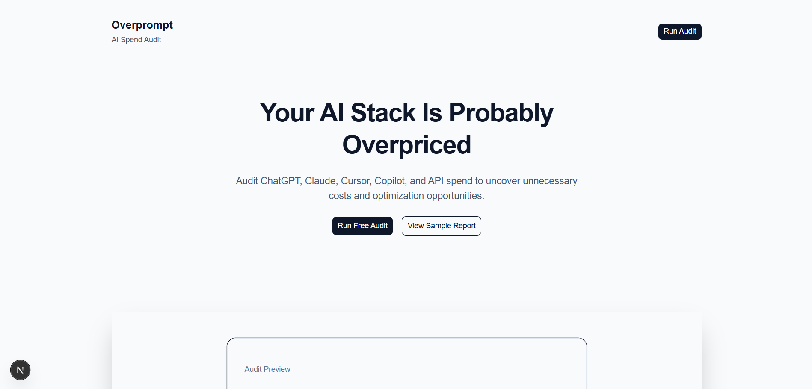

# Overprompt

Overprompt is a lightweight AI spend audit tool designed to help teams identify redundant subscriptions, pricing inefficiencies, and workflow-tool mismatches across modern AI platforms.

The product focuses on SaaS optimization principles rather than subjective AI model comparisons.

---

<<<<<<< HEAD
=======
# Live Demo

https://your-vercel-url.vercel.app

---

>>>>>>> 73261a2 (docs: finalize product documentation and README)
# Problem

AI tool adoption is growing faster than AI spend visibility.

Many users and small teams now simultaneously pay for:
- ChatGPT
- Claude
- Cursor
- GitHub Copilot
- Gemini
- API subscriptions

As workflows become increasingly AI-native, subscription overlap and underutilized premium plans can quietly create unnecessary monthly costs.

Overprompt was built to explore whether AI tooling setups actually align with:
- workflow requirements
- team size
- usage patterns
- pricing efficiency

---

# Core Features

- AI spend audit workflow
- Workflow-aware recommendation engine
- Dynamic savings estimation
- SaaS-style audit interface
- Pricing-backed recommendation logic
- Vendor-neutral optimization approach
- Explainable recommendation reasoning

---

# Product Philosophy

The project intentionally avoids fake “AI-generated” recommendations.

Instead, the audit engine uses deterministic heuristics based on:
- workflow fit
- pricing structure
- team size
- subscription overlap
- utilization assumptions

The goal is to create recommendations that feel:
- believable
- explainable
- financially motivated
- operationally useful

rather than acting like another generic AI chatbot.

---

# Tech Stack

## Frontend
- Next.js
- React
- TypeScript
- Tailwind CSS
- shadcn/ui

## Deployment
- Vercel

---

# Architecture Overview

The current MVP follows a lightweight frontend-first architecture.

Flow:
1. User enters AI tooling and spend information
2. Form state is handled locally with React state
3. Deterministic audit logic evaluates the input
4. Recommendations and estimated savings render dynamically

The architecture intentionally prioritizes:
- iteration speed
- product clarity
- explainable logic
- MVP simplicity

over production-scale infrastructure.

---

# Recommendation Logic

The recommendation engine evaluates factors such as:
- pricing efficiency
- workflow alignment
- spend-per-seat assumptions
- collaboration plan justification
- overlapping subscriptions

The system is intentionally vendor-neutral and designed around SaaS optimization reasoning rather than AI model preference.

---

# Current MVP Scope

<<<<<<< HEAD
The current version supports:
- single-tool audits
=======
The current version is currently optimized for:
- single-tool audit workflows
>>>>>>> 73261a2 (docs: finalize product documentation and README)
- dynamic recommendation rendering
- savings estimation
- structured pricing research integration

Planned future improvements include:
- multi-tool audit support
- persistent audit history
- API spend analysis
- exportable reports
- organization-level optimization insights

---

<<<<<<< HEAD
# Local Development

## Clone Repository

```bash
git clone <repository-url>
cd overprompt
=======
# Screenshots

## Landing Page



## Audit Result


---

# Why Deterministic Recommendations?

The project intentionally avoids fake “AI-generated” audit reasoning.

Recommendations are based on transparent heuristics tied to:
- workflow fit
- pricing efficiency
- subscription overlap
- utilization assumptions

This keeps outputs:
- explainable
- testable
- financially grounded
- easier to trust

---

# Local Development

## Clone Repository

```bash
git clone <repository-url>
cd overprompt
```

## Install Dependencies

```bash
npm install
```

## Run Development Server

```bash
npm run dev
```

Application runs locally at:

```txt
http://localhost:3000
```

---

# Documentation

Additional project documentation includes:
- `ARCHITECTURE.md`
- `ECONOMICS.md`
- `GTM.md`
- `METRICS.md`
- `PRICING_DATA.md`
- `DEVLOG.md`
- `REFLECTION.md`
- `TESTS.md`
- `PROMPTS.md`

These files document:
- product reasoning
- pricing research
- technical decisions
- recommendation logic
- development process
- testing philosophy

---

# Key Takeaway

The project explores a simple idea:

As AI tooling becomes more fragmented, users increasingly need visibility into whether their subscriptions are creating real value or unnecessary redundancy.

Overprompt is an attempt to make that process understandable, lightweight, and actionable.
>>>>>>> 73261a2 (docs: finalize product documentation and README)
